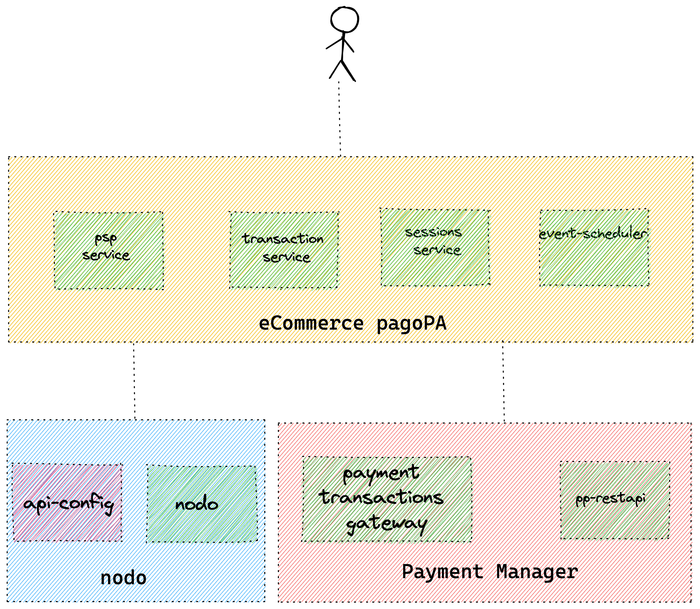

# pagoPA eCommerce session µ-service
Repo for pagoPA-ecommerce session handler micro-service

<!-- TABLE OF CONTENTS -->
<details>
  <summary>Table of Contents</summary>
  <ol>
    <li>
      <a href="#about-the-project">About The Project</a>
      <ul>
        <li><a href="#built-with">Built With</a></li>
      </ul>
    </li>
    <li>
      <a href="#getting-started">Getting Started</a>
      <ul>
        <li><a href="#prerequisites">Prerequisites</a></li>
        <li><a href="#installation">Installation</a></li>
      </ul>
    </li>
    <li><a href="#usage">Usage</a></li>
    <li><a href="#contact">Contact</a></li>
  </ol>
</details>

<!-- ABOUT THE PROJECT -->
## About The Project

This µ-service is responsible for the session handling during a payment transaction in the pagoPA eCommerce.
Given a `rptId` and a user e-mail it will generate an authentication token (JWT) that will be used to interact with
the API exposed by the `transactions-service` µ-service.

The set of API exposed by this project allow to:
* Create a session token given a valid `rptId` and email
* Retrieve a session token given an `rptId`
* Retrieve all session data


<p align="right">(<a href="#top">back to top</a>)</p>

<!-- Built with -->
### Built With

* [Java 17](https://www.oracle.com/java/technologies/javase/jdk17-archive-downloads.html)
* [Spring Boot](https://spring.io/projects/spring-boot)
* [Maven](https://maven.apache.org/)
* [Kotlin](https://kotlinlang.org/)
* [Redis](https://redis.io/)
* [Docker](https://www.docker.com/)

<p align="right">(<a href="#top">back to top</a>)</p>

<!-- GETTING STARTED -->
## Getting Started
The service can be started as Java Boot Spring application, or as a container by using the `docker-compose` file provided.

### Prerequisites
* A redis db up and running (Only to run the project without docker, see below for further information)
### Java Spring Boot Application
To start the service as a Java Spring Booot application execute the command below. The service will try to connect with
a redis db hosted on `redis` on port `6379` without password. This parameters can be customized by update the application
properties inside `src/main/resources/application.properties`.

  ```sh
  mvn spring-boot:run
  ```

### Docker container
To run the project as a docker container execute the commands listed below. This setup will also start the redis db.

Package the required target files
  ```sh
  mvn clean && mvn package
  ```
Bring the containers up
  ```sh
  docker-compose up --build
  ```
